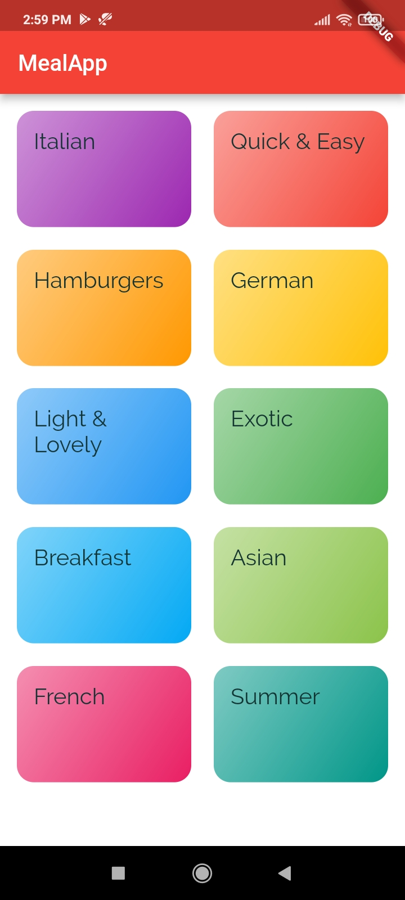
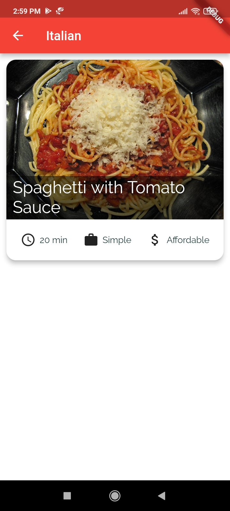
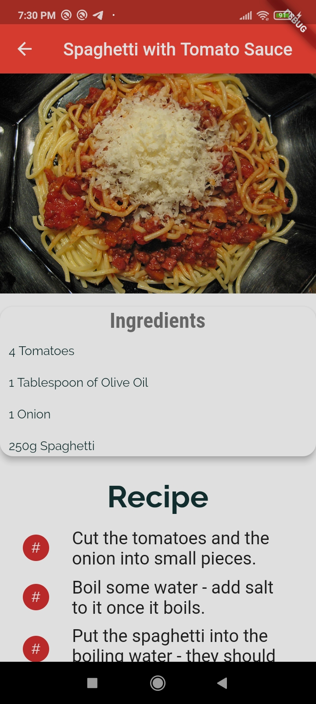
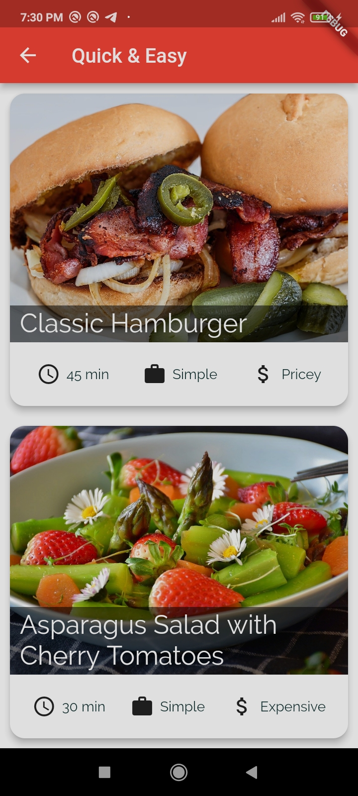
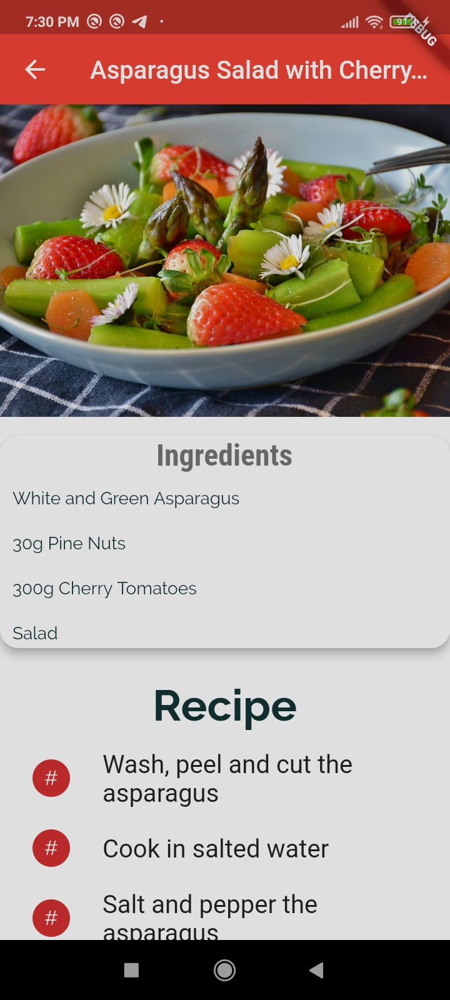

# MealsApp


It is an app to show different meals of different countries and suited for different moods and their pictures and how to cook them with proper ingredients and step by step recipes. 


## How to setup on your system :- 

#### Requirements : 
 1. Flutter
 2. Android Studio 
 3. Emulator/Real Device(Android/IOS)

#### How to install : 

1. Check the Official Docs link for installing Flutter : https://flutter.dev/docs/get-started/install 
2. How to setup the emulator on android studio : https://developer.android.com/studio/run/emulator 
3. or, connect a physical device : https://stackoverflow.com/questions/54444538/how-do-i-run-test-my-flutter-app-on-a-real-device


## Getting Started

Follow these instructions to build and run the project

### Setup Flutter

A detailed guide for multiple platforms setup could be find [here](https://flutter.dev/docs/get-started/install/)

### Setup Project

- Clone this repository using `git clone https://github.com/RohanSengupta326/MealsApp.git`.
- `cd` into `MealsApp`.
- `flutter pub get` to get all the dependencies.
- Generate files using Builder Runner (**required**) 
```
flutter packages pub run --no-sound-null-safety build_runner build
```

## Screenshots
<p>





</p>

