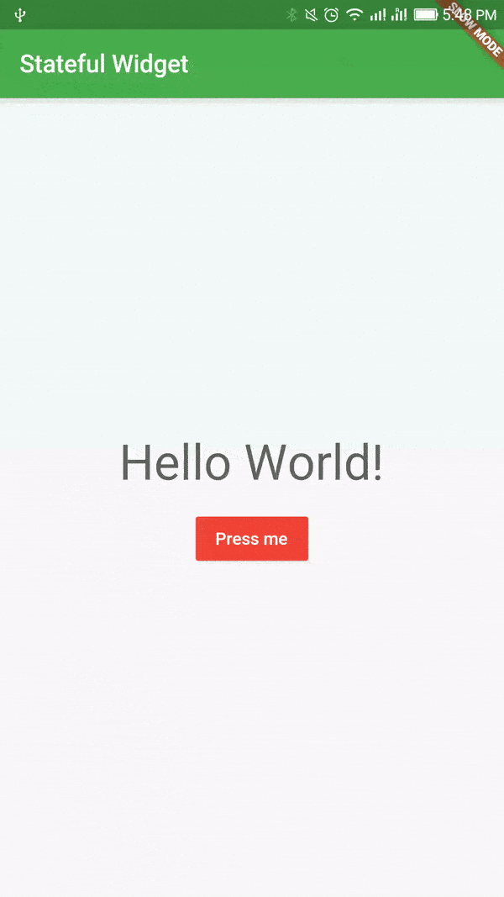
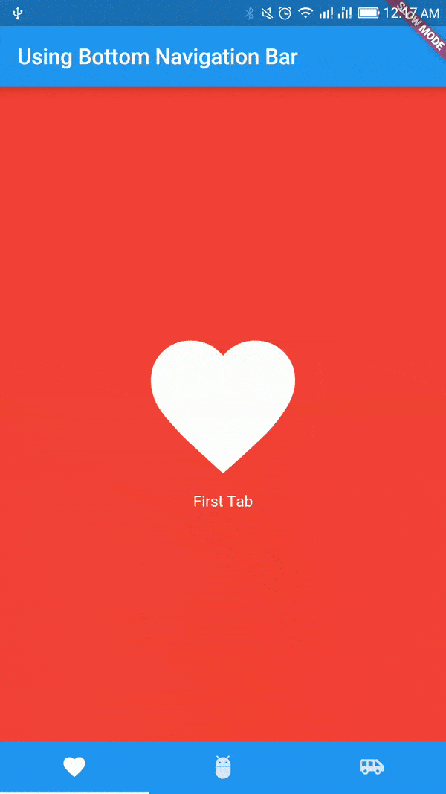
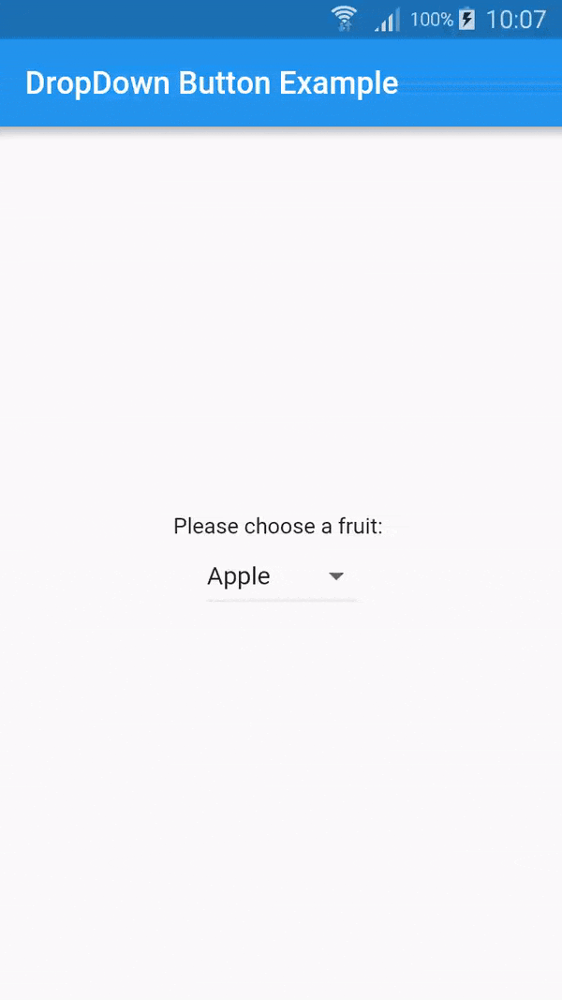
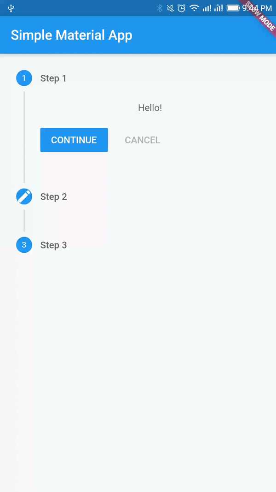
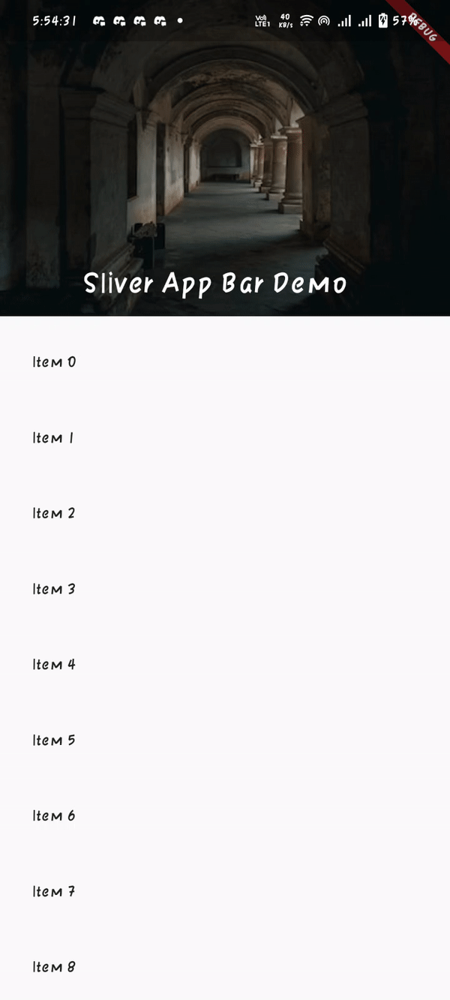
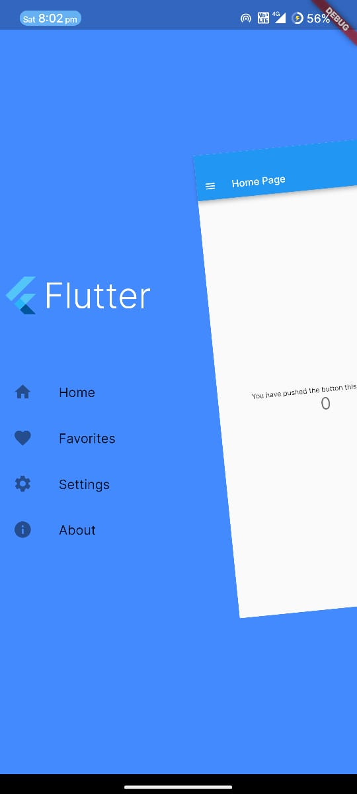

### Show some :heart: and star the repo to support the project

[](https://github.com/nisrulz/flutter-examples) [](https://github.com/nisrulz/flutter-examples/fork) [](https://github.com/nisrulz/flutter-examples) [](https://github.com/nisrulz/flutter-examples)  
[](https://twitter.com/nisrulz)

Main repository containing all the example apps demonstrating features/functionality/integrations in [Flutter](https://flutter.io/) application development

### Featured In

- [Official Flutter Samples](https://github.com/flutter/samples/blob/d500d15c0f098b56e5bd549b32485cedba4843ef/INDEX.md#flutter-examples--)
- [Flutter Weekly #11](https://mailchi.mp/5db146a7468b/flutter-weekly-11)
- [Awesome Flutter](https://github.com/Solido/awesome-flutter#demonstrations)


Lookup Links: [[Setup Flutter](https://flutter.io/setup/)] [[Widgets Catalog](https://flutter.io/widgets/)] [[Dart Lang](https://flutter.io/bootstrap-into-dart/)]

    

## Example apps

1. [Custom Drawer](/custom_home_drawer)
1. [DropDown Button](/dropdown_button)
1. [Enable Splash Screen](/enabling_splash_screen)
1. [Firebase Analytics Integration](/analytics_integration)
1. [Firebase Crashlytics Integration](/firebase_crash_reporting)
1. [Google Signin](/google_signin)
1. [Grid Layout](/grid_layout)
1. [Image Editor](/image_editor)
1. [Image from Network](/image_from_network)
1. [Infinite List](/infinite_list)
1. [Load local image](/load_local_image)
1. [Load local json](/load_local_json)
1. [Navigation Drawer](/navigation_drawer)
1. [Persist Key Value](/persist_key_value)
1. [Push Notifications](/push_notifications)
1. [Simple Material App](/simple_material_app)
1. [Sliver App Bar](/sliver_app_bar_example)
1. [Stateful Widget](/stateful_widget)
1. [Stateless counter app](/statless_counter_app)
1. [Stateless Widgets](/stateless_widgets)
1. [Todo list using Provider](/todo_list_using_provider)
1. [Unit Testing](/unit_testing)
1. [Using Alert Dialog](/using_alert_dialog)
1. [Using Bottom Navigation Bar](/using_bottom_nav_bar)
1. [Using Bottom Sheet](/bottom_sheet)
1. [Using Custom Fonts](/using_custom_fonts)
1. [Using EditText](/using_edittext)
1. [Using Gradient](/using_gradient)
1. [Using HTTP GET](/using_http_get)
1. [Using InteractiveViewer](/using_interactiveviewer)
1. [Using Listview](/using_listview)
1. [Using ListwheelScrollView](/using_listwheelscrollview)
1. [Using SnackBar](/using_snackbar)
1. [Using Stepper](/using_stepper)
1. [Using Tabs](/using_tabs)
1. [Using Theme](/using_theme)
1. [View PDF File](/view_pdf_file)

### Complete apps with multiple features

1. [Covid-19 App](/covid19_mobile_app)
1. [BMI Calculator](/bmi_calculator)
1. [Expense Planner](/expense_planner)
1. [Notes App](/using_firebase_db)
1. [Tip Calculator](/tip_calculator)

# Get packages for all flutter projects

- Once you have cloned this repo, navigate to the root of this repo.
- Next run `./get_packages.sh`
  > Make sure the script is executable. If it is not, then run `chmod +x get_packages.sh` first to make it executable.
- Done!

# Pull Requests

I welcome and encourage all pull requests. It usually will take me 24-48 hours to respond to any issue or request. Here are some basic rules to follow to ensure the timely addition of your request:

1. Match coding style (braces, spacing, etc.) This is best achieved using `Reformat Code` feature of Android Studio `CMD`+`Option`+`L` on Mac and `CTRL` + `ALT` + `L` on Linux + Windows .
1. If it's a feature, bugfix, or anything please only change the code to what you specify.
1. Please keep PR titles easy to read and descriptive of changes, this will make them easier to merge :)
1. Pull requests _must_ be made against the `develop` branch. Any other branch (unless specified by the maintainers) will get rejected. [Here is a link to a good PR made to this repo.](https://github.com/nisrulz/flutter-examples/pull/130)
1. Check for existing [issues](https://github.com/nisrulz/flutter-examples/issues) first, before filing an issue.
1. **Make sure you follow the set standard as all other projects in this repo do**
    > **Make sure the package name conforms to the format: `github.nisrulz.<app_name>`**

## Extra
Since the repo is pretty large now, I am sure many folks would like to download only some of the projects. To tackle that follow the steps below:
  - Install `svn` using homebrew (Mac/Linux)
    ```bash
    brew install svn
    ```
  - Copy the name of the example folder in this repo i.e `simple_material_app`
  - Next, replace `example_folder` in the below command:

    ```bash
    svn checkout https://github.com/nisrulz/flutter-examples/trunk/example_folder
    ```
    i.e Consider `simple_material_app` is the name of the example's folder, the command becomes:
    ```bash
    svn checkout https://github.com/nisrulz/flutter-examples/trunk/simple_material_app
    ```
  - Done! You should have the specific example all checked out!

## Author & support
This project was created by [Nishant Srivastava](https://github.com/nisrulz/nisrulz.github.io#nishant-srivastava) but hopefully developed and maintained by many others. See the [the list of contributors here](https://github.com/nisrulz/flutter-examples/graphs/contributors).

If you appreciate my work, consider [buying me](https://www.paypal.me/nisrulz/5usd) a cup of :coffee: to keep me recharged :metal: [[PayPal](https://www.paypal.me/nisrulz/5usd)]


License
=======

    Copyright 2017 Nishant Srivastava

    Licensed under the Apache License, Version 2.0 (the "License");
    you may not use this file except in compliance with the License.
    You may obtain a copy of the License at

       http://www.apache.org/licenses/LICENSE-2.0

    Unless required by applicable law or agreed to in writing, software
    distributed under the License is distributed on an "AS IS" BASIS,
    WITHOUT WARRANTIES OR CONDITIONS OF ANY KIND, either express or implied.
    See the License for the specific language governing permissions and
    limitations under the License.
