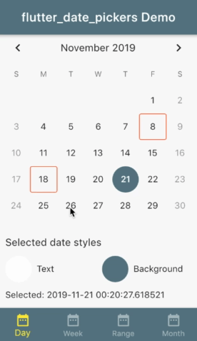

# flutter_date_pickers  
  
[](https://github.com/MariaMelnik/flutter_date_pickers/actions)
[](https://pub.dev/packages/flutter_date_pickers)
[](https://pub.dev/packages/flutter_date_pickers)
[](https://pub.dev/packages/flutter_date_pickers/score)
[](https://github.com/MariaMelnik/flutter_date_pickers)
[](https://opensource.org/licenses/MIT)
[](https://github.com/MariaMelnik/flutter_date_pickers/)
<!--[](https://codecov.io/gh/MariaMelnik/flutter_date_pickers)
[](https://github.com/tenhobi/effective_dart)-->
  
  
Allows to use date pickers without dialog.
Provides some customizable styles for date pickers.

A set of date pickers:
* `DayPicker` for one day
* `WeekPicker` for whole week
* `RangePicker` for random range
* `MonthPicker` for month



## How to style date picker
Every date picker constructor take a style object as a parameter (if no styles passed - defaults will be used).

For single value pickers (DayPicker, MonthPicker) it is DatePickerStyles object;

For range pickers (WeekPicker, RangePickers) it is DatePickerRangeStyles object;

Customizable styles:
for all date pickers

| Property | Description |
|---|---|
| TextStyle displayedPeriodTitle | title of the date picker |
| TextStyle currentDateStyle | style for current date |
| TextStyle disabledDateStyle | style for disabled dates (before first and after last date user can pick) |
| TextStyle selectedDateStyle | style for selected date |
| BoxDecoration selectedSingleDateDecoration | decoration for selected date in case single value is selected |
| TextStyle defaultDateTextStyle | style for date which is neither current nor disabled nor selected |

only for range date pickers (WeekPicker, RangePicker)

| Property | Description |
|---|---|
| BoxDecoration selectedPeriodStartDecoration | decoration for the first date of the selected range |
| BoxDecoration selectedPeriodLastDecoration | decoration for the first date of the selected range |
| BoxDecoration selectedPeriodMiddleDecoration | Decoration for the date of the selected range which is not first date and not end date of this range |

## How to make some dates not selectable date picker
By default only dates before `firstDate` and after `lastDate` are not selectable. But you can set custom disabled days.
`DayPicker`, `WeekPicker` and `RangePicker` take a `SelectableDayPredicate selectableDayPredicate`
where you can specify function which returns if some date is disabled or not.

If some date is disabled for selection it gets `disabledDateStyle`.

If selected range or week pretends to include such disabled date `UnselectablePeriodException` occurs.
To handle it - pass `onSelectionError` callback to date picker.

## How to make special decorations for some dates
By default cells are decorated with `datePickerStyles` slyles (or default if no styles was passed to date picker).
If you need special decoration for some days use `eventDecorationBuilder`.
Currently only for `DayPicker`, `WeekPicker` and `RangePicker`.

- If date is not selected basic styles will be merged with styles from `eventDecorationBuilder`.
- If date is current date styles from `eventDecorationBuilder` win (if there are).
- Otherwise basic styles (`datePickerStyles`) win.

## What time I will get after selection?
If one day selected:
 you will get start of the day (00:00:00) by default. If selected `firstDate` - you will get time of it.

If range/week selected:
 for start you will get start of the day (00:00:00) by default. If selected `firstDate` - you will get time of it.
 for end you will get end of the day (23:59:59.999) by default. If selected `lastDate` - you will get time of it.

If month selected:
  you will get start (00:00:00) of the 1 day of month by default.
  If selected month same as month of the `firstDate` - you will get `firstDate`.

## Usage

```dart
// Create week date picker with passed parameters
Widget buildWeekDatePicker (DateTime selectedDate, DateTime firstAllowedDate, DateTime lastAllowedDate, ValueChanged<DatePeriod> onNewSelected) {

 // add some colors to default settings
    DatePickerRangeStyles styles = DatePickerRangeStyles(
      selectedPeriodLastDecoration: BoxDecoration(
          color: Colors.red,
          borderRadius: BorderRadius.only(
              topRight: Radius.circular(10.0),
              bottomRight: Radius.circular(10.0))),
      selectedPeriodStartDecoration: BoxDecoration(
        color: Colors.green,
        borderRadius: BorderRadius.only(
            topLeft: Radius.circular(10.0), bottomLeft: Radius.circular(10.0)),
      ),
      selectedPeriodMiddleDecoration: BoxDecoration(
          color: Colors.yellow, shape: BoxShape.rectangle),
    );
    
  return WeekPicker(
      selectedDate: selectedDate,
      onChanged: onNewSelected,
      firstDate: firstAllowedDate,
      lastDate: lastAllowedDate,
      datePickerStyles: styles
  );
}
```

## Example app
Please checkout [example](https://github.com/MariaMelnik/flutter_date_pickers/tree/master/example).

For help getting started with Flutter, view our
[online documentation](https://flutter.io/docs), which offers tutorials,
samples, guidance on mobile development, and a full API reference.
