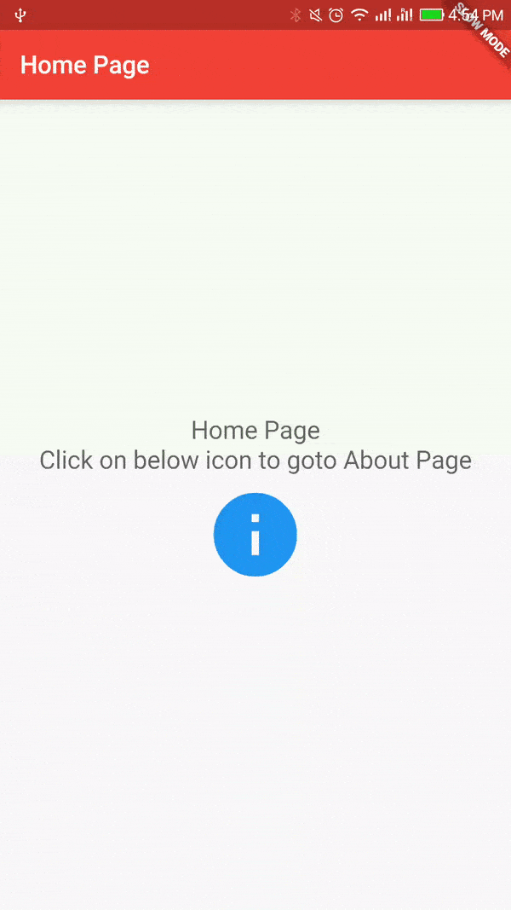

# Handling Routes

Mobile apps typically reveal their contents via full-screen elements called "screens" or "pages". In Flutter these elements are called routes and they're managed by a Navigator widget. The navigator manages a stack of Route objects and provides methods for managing the stack, like Navigator.push and Navigator.pop.

Read [[Documentation](https://docs.flutter.io/flutter/widgets/Navigator-class.html)]

## Getting Started

For help getting started with Flutter, view online [documentation](http://flutter.dev/).