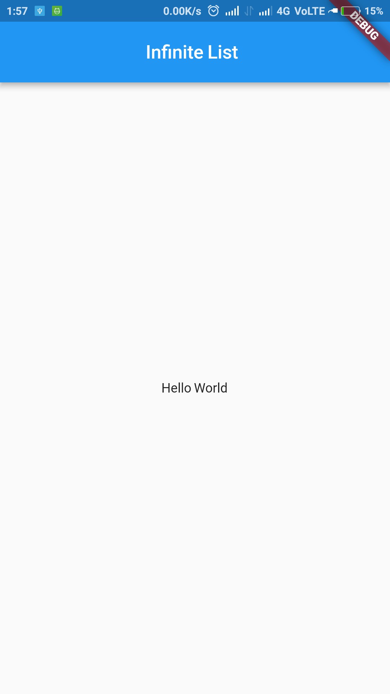
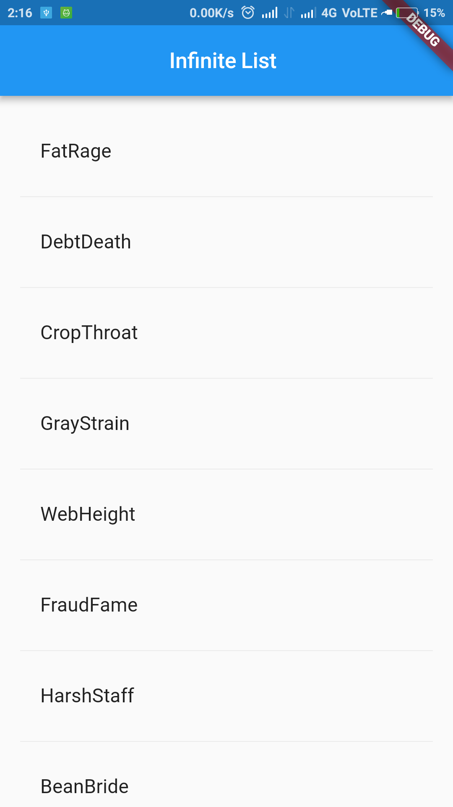
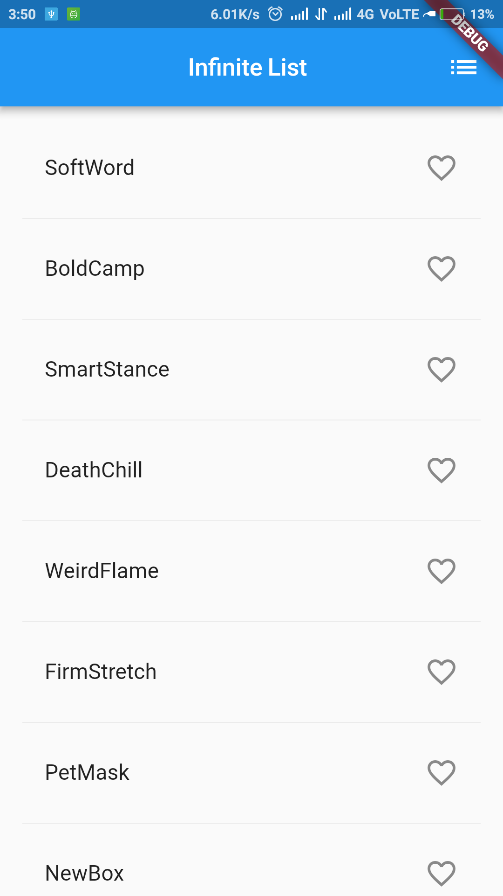

# infinite_list

An infinite list using flutter

## Screencast

### Step/Commit - 1

### Step/Commit - 2

### Step/Commit - 3-4

### Step/Commit - 5

### Step/Commit - 6

### Step/Commit - 7 Final

