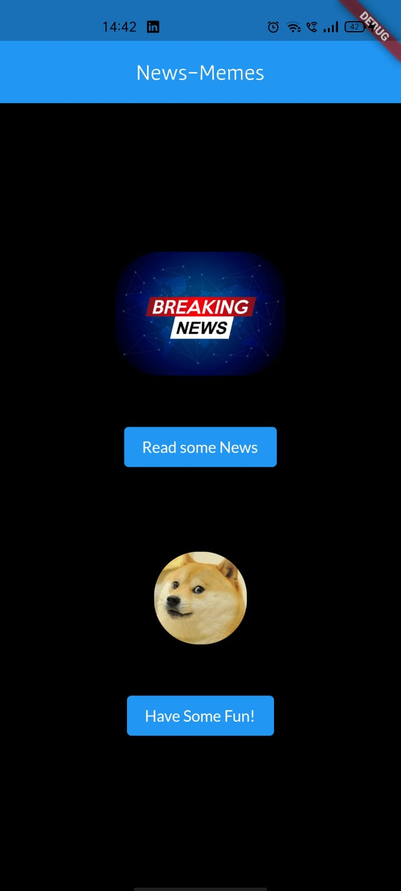
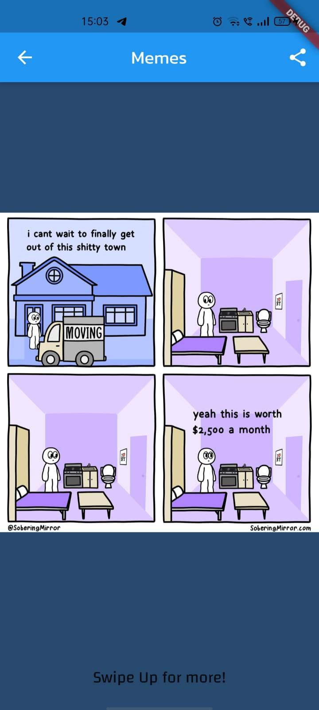

# news_memes_app

An app which shows latest news and funny memes.

# Steps to follow:
 - cd into news_memes_app under flutter_examples.
 - Login to https://newsapi.org/ with your account and get APIKEY.
 - go to news_memes_app/lib/services/getNews.dart. and paste your APIKey.

# ScreenRecording:
 [screenrecording](demo/vid_1.mp4)

# ScreenShots:

  
  
  

