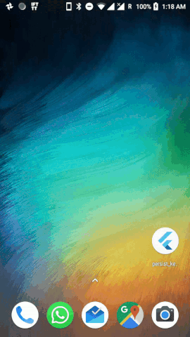

# Persist Key Value

Example app showing storing key value on disk using [shared_preference](https://pub.dartlang.org/packages/shared_preferences) plugin

## Getting Started

For help getting started with Flutter, view online [documentation](http://flutter.dev/).
