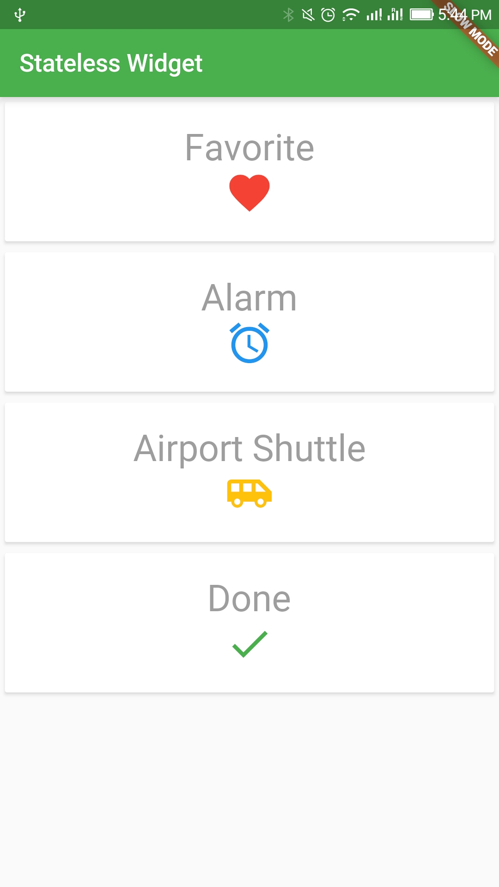

# Stateless Widget

A widget that does not require mutable state.

A stateless widget is a widget that describes part of the user interface by building a constellation of other widgets that describe the user interface more concretely. The building process continues recursively until the description of the user interface is fully concrete 

Read [[Documentation](https://docs.flutter.io/flutter/widgets/StatelessWidget-class.html)]

## Getting Started

For help getting started with Flutter, view online [documentation](http://flutter.dev/).