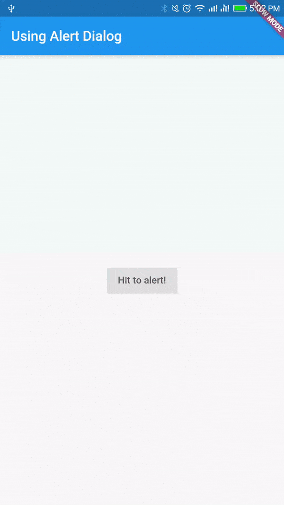

# Using Alert Dialog

A material design alert dialog.

An alert dialog informs the user about situations that require acknowledgement. An alert dialog has an optional title and an optional list of actions. The title is displayed above the content and the actions are displayed below the content.

Read [[Documentation](https://docs.flutter.io/flutter/material/AlertDialog-class.html)]

## Getting Started

For help getting started with Flutter, view online [documentation](http://flutter.dev/).