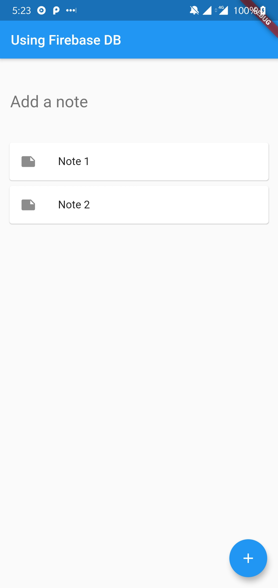

# Using Firebase DB

A very basic note taking app to demonstrate the usage of firebase realtime database with flutter. Follow this [guide](https://firebase.google.com/docs/flutter/setup) to setup firebase to work with flutter.

Add notes by using the Floating Action Button and delete notes by long pressing them.

>This demo will not work without the `google-services.json` file. 

## Getting Started

For help getting started with Flutter, view online [documentation](http://flutter.dev/).
