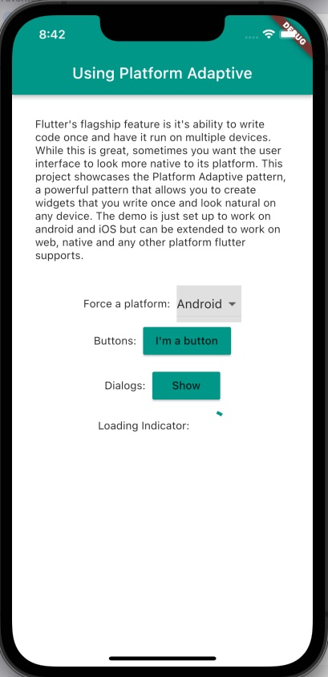
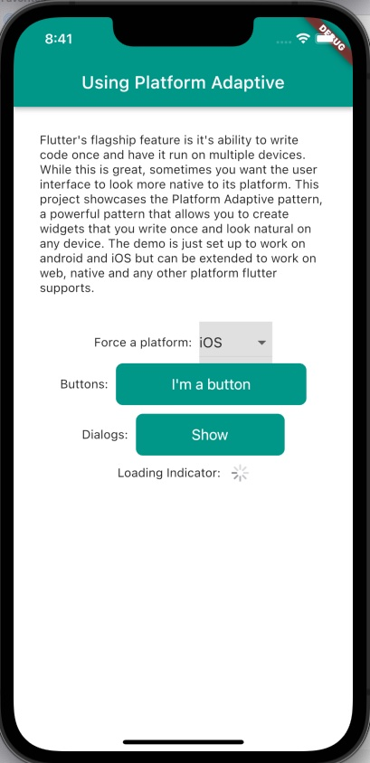

# Using Platform Adaptive Pattern 

Example app showing usage of the Platform Adaptive Pattern.

Flutter's flagship feature is it's ability to write code once and have it run on multiple devices. While this is great, sometimes you want the user interface to look more native to its platform. This project showcases the Platform Adaptive pattern, a powerful pattern that allows you to create widgets that you write once and look natural on any device. The demo is just set up to work on android and iOS but can be extended to work on web, native and any other platform flutter supports.

Pattern is inspired by [this article](https://codewithandrea.com/videos/flutter-platform-aware-widgets-dialogs/)

# Demo

## Getting Started

For help getting started with Flutter, view online [documentation](http://flutter.dev/).