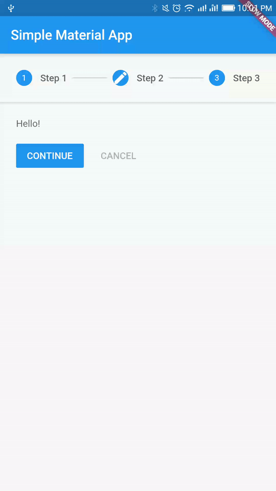

# Using Stepper

A material stepper widget that displays progress through a sequence of steps. Steppers are particularly useful in the case of forms where one step requires the completion of another one, or where multiple steps need to be completed in order to submit the whole form.

Read [[Documentation](https://docs.flutter.io/flutter/material/Stepper-class.html)] [[Material Design Spec](https://material.io/guidelines/components/steppers.html)]

 

## Getting Started

For help getting started with Flutter, view online [documentation](http://flutter.dev/).
