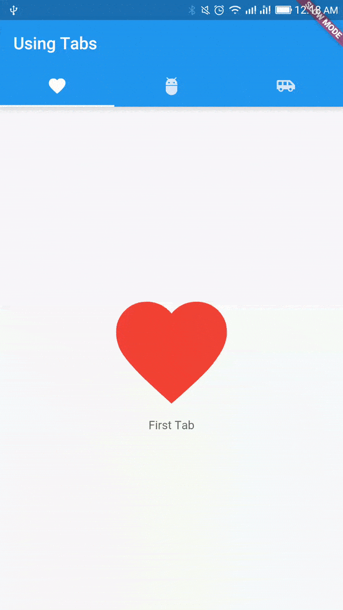

# Using Tab Bar

A material design widget that displays a horizontal row of tabs.

Read [[Documentation](https://docs.flutter.io/flutter/material/TabBar-class.html)] [[Material Design Spec](https://material.io/guidelines/components/tabs.html)]

## Getting Started

For help getting started with Flutter, view online [documentation](http://flutter.dev/).