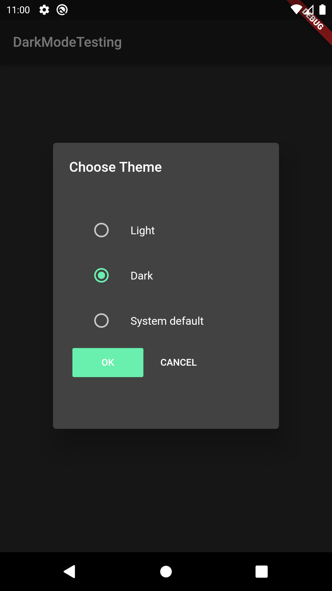
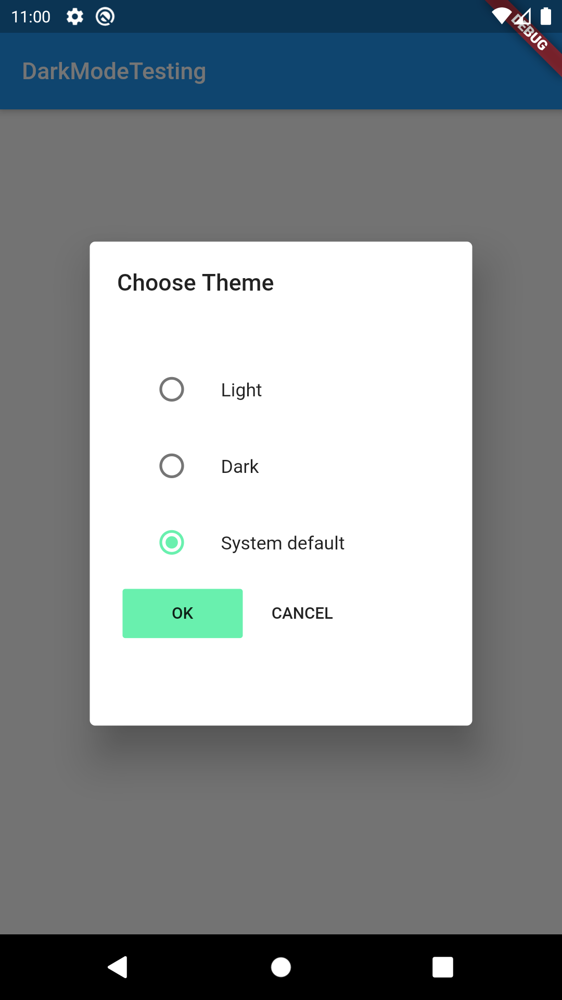
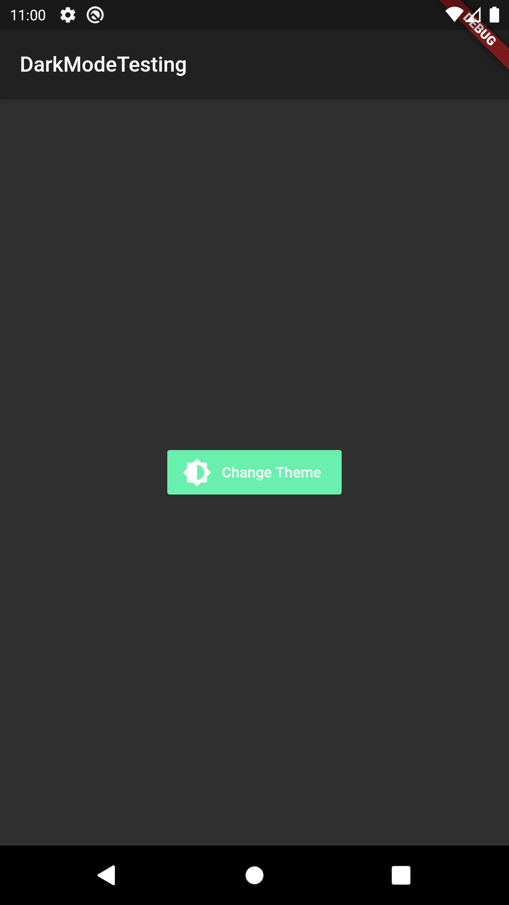
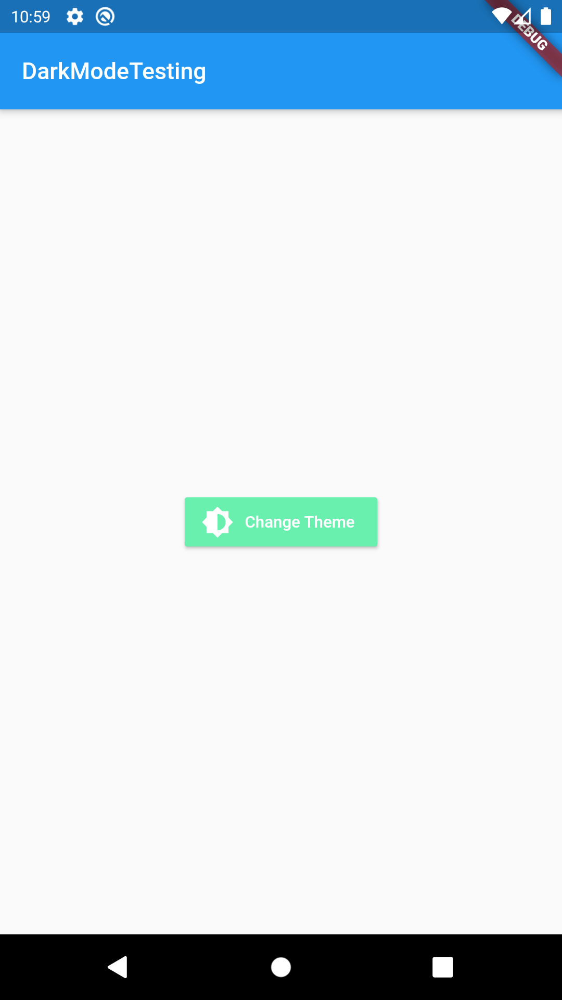

# whatsapp_theming
An example app which demonstrates dark light and auto switching of theme options just like what whatsapp provides

## Getting Started

I have used shared preferences and theme provider package to develop such kind of dynamic theme changing hope it helps!

For help getting started with Flutter, view our
[online documentation](https://flutter.dev/docs), which offers tutorials,
samples, guidance on mobile development, and a full API reference.
